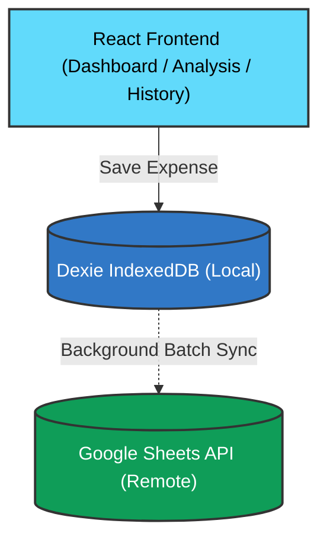

# 💸 Expense Tracker — Coding Gurus

> A modern, local-first Progressive Web App (PWA) for effortlessly tracking personal expenses backed by Google Sheets.

[](https://expense-manager-cg.vercel.app)
[](https://react.dev)
[](https://www.typescriptlang.org)
[](https://firebase.google.com)
[](https://vitejs.dev)

---

## ✨ Features

- **🔐 Google Sign-In** — One-click authentication via Firebase Auth
- **📊 Google Sheets Sync** — All data synced to your personal Google Sheet in real-time
- **📱 PWA** — Installable on iOS and Android like a native app, works offline
- **🌓 Dark / Light Theme** — Seamless theme toggle with system preference detection
- **📅 Custom Date Range** — Filter expenses by Today, This Month, Last Month, All Time, or any custom range
- **🗂 Categories** — Pre-built categories (Food, Transport, Health, etc.) + custom category support
- **💰 50/30/20 Budget Split** — Automatically classifies expenses as Needs, Wants, or Investments
- **📈 Analysis Charts** — Beautiful donut & gradient bar charts with custom tooltips
- **📋 History** — Full transaction history grouped by date
- **⚙️ Settings** — Manage account and spreadsheet configuration
- **🔄 Offline-first** — Expenses saved to IndexedDB locally first, synced to Sheets in background

---

## 🛠 Tech Stack

| Layer | Technology |
|---|---|
| Framework | React 18 + TypeScript |
| Build Tool | Vite |
| Styling | Tailwind CSS + ShadCN UI |
| Auth | Firebase Authentication (Google OAuth) |
| Storage | Dexie (IndexedDB) — local-first |
| Sync | Google Sheets API v4 (via fetch) |
| Charts | Recharts |
| PWA | vite-plugin-pwa + Workbox |
| Deployment | Vercel |

---

## 🏗 Architecture



**Key design decisions:**
- Expenses are saved to **IndexedDB first** for instant UI and offline support
- A **SyncService** batches writes to Google Sheets in the background
- Analysis & Dashboard compute totals **locally** from IndexedDB — no API round trips
- The spreadsheet ID is stored in the **Drive App Data folder** (`drive.appdata`) — a hidden, app-exclusive folder — for cross-device detection with minimal permissions

---

## 🚀 Getting Started

### Prerequisites

- Node.js ≥ 18
- A Google account
- A Firebase project with Google Sign-In enabled
- Google Sheets API enabled in Google Cloud Console
- Google Drive API enabled in Google Cloud Console

### 1. Clone the Repository

```bash
git clone https://github.com/darshan1137/Expense-Tracker.git
cd Expense-Tracker
npm install
```

### 2. Set Up Firebase

1. Go to [Firebase Console](https://console.firebase.google.com) → Create a project
2. Enable **Authentication → Google** as a sign-in provider
3. Add `localhost` and your Vercel domain to the **Authorized domains** list

### 3. Enable Google APIs

In [Google Cloud Console](https://console.cloud.google.com):
1. Enable **Google Sheets API**
2. Enable **Google Drive API**

### 4. Configure Environment Variables

Create a `.env.local` file in the project root:

```env
VITE_FIREBASE_API_KEY=your_api_key
VITE_FIREBASE_AUTH_DOMAIN=your_project.firebaseapp.com
VITE_FIREBASE_PROJECT_ID=your_project_id
VITE_FIREBASE_STORAGE_BUCKET=your_project.appspot.com
VITE_FIREBASE_MESSAGING_SENDER_ID=your_sender_id
VITE_FIREBASE_APP_ID=your_app_id
VITE_GOOGLE_API_KEY=your_google_api_key
```

### 5. Run Locally

```bash
npm run dev
```

Open `http://localhost:5173`

---

## 📦 Project Structure

```
src/
├── components/
│   ├── Layout.tsx              # App shell with top/bottom navigation
│   ├── ThemeProvider.tsx       # Dark/Light mode context
│   ├── DateFilterProvider.tsx  # Global date range state
│   └── DateRangeSelector.tsx   # Date range picker UI
├── pages/
│   ├── Login.tsx               # Google Sign-In screen
│   ├── Onboarding.tsx          # Spreadsheet setup / detection
│   ├── Dashboard.tsx           # Home screen with summary cards
│   ├── AddExpense.tsx          # Add expense form
│   ├── Analysis.tsx            # Charts and insights
│   ├── History.tsx             # Transaction history
│   └── Settings.tsx            # Account settings
├── services/
│   ├── firebase.ts             # Firebase app + Google provider
│   ├── googleAuth.ts           # Sign in / sign out / token refresh
│   ├── googleSheets.ts         # Sheets API + Drive appData config
│   └── syncService.ts          # IndexedDB ↔ Sheets sync engine
├── db/
│   └── indexedDB.ts            # Dexie schema and instance
├── utils/
│   ├── categories.ts           # Default categories and type mapping
│   └── transactionId.ts        # ID generation helper
└── types/
    └── expense.ts              # Expense TypeScript type
```

---

## 🔐 OAuth Scopes Used

| Scope | Reason |
|---|---|
| `spreadsheets` | Read and write expense data to Google Sheets |
| `drive.appdata` | Store/retrieve the spreadsheet ID in a hidden, app-exclusive Drive folder |

> **Privacy note:** The `drive.appdata` scope gives access _only_ to a hidden folder that is invisible to users and inaccessible to other apps. No other Drive files are accessed.

---


## 🚢 Deployment

### Deploy to Vercel

```bash
npm install -g vercel
vercel login
vercel --prod
```

Add your environment variables in the **Vercel Dashboard → Project → Settings → Environment Variables**.

### Continuous Deployment

Push to `main` branch on GitHub — Vercel automatically deploys via GitHub integration.

---

## 🤝 Contributing

Contributions are welcome! Please:
1. Fork the repository
2. Create a feature branch (`git checkout -b feature/my-feature`)
3. Commit your changes (`git commit -m "Add my feature"`)
4. Push to the branch (`git push origin feature/my-feature`)
5. Open a Pull Request

---

## 👤 Contributor

**Darshan Khapekar**
- 📧 [darshankhapekar.me@gmail.com](mailto:darshankhapekar.me@gmail.com)
- 🐙 [github.com/darshan1137](https://github.com/darshan1137)

---

## 📄 License

This project is open source and available under the [MIT License](LICENSE).

---

<div align="center">
  <sub>Built with ❤️ by Darshan Khapekar · Coding Gurus</sub>
</div>